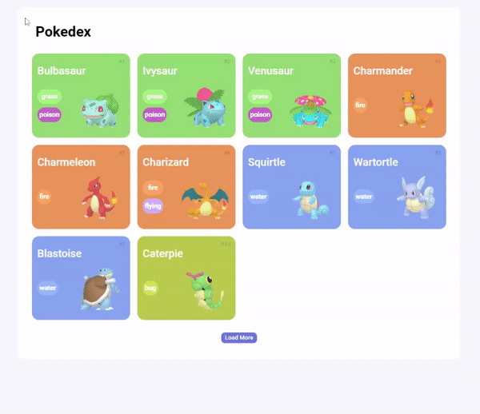

<h1 align="center"> JS Developer Pokedex 🔥💧⚡🍃 </h1>

Projeto "Construindo uma Pokédex com JavaScript" através do consumo de uma API REST, feito no bootcamp da DIO.ME

  <a href="#-tecnologias">Tecnologias</a>&nbsp;&nbsp;&nbsp;|&nbsp;&nbsp;&nbsp;
  <a href="#-projeto">Projeto</a>&nbsp;&nbsp;&nbsp;|&nbsp;&nbsp;&nbsp;

 

  

## 🚀 Tecnologias

Esse projeto foi desenvolvido com as seguintes tecnologias:

- HTML
- CSS
- JavaScript
- JSON

## 💻 Projeto

Site desenvolvido com o intuito de aprender a fazer requests em uma API no curso de javascript da [DIO](https://web.dio.me).

---

Feito com ♥ by Tiago Alves 🔥💧⚡🍃
